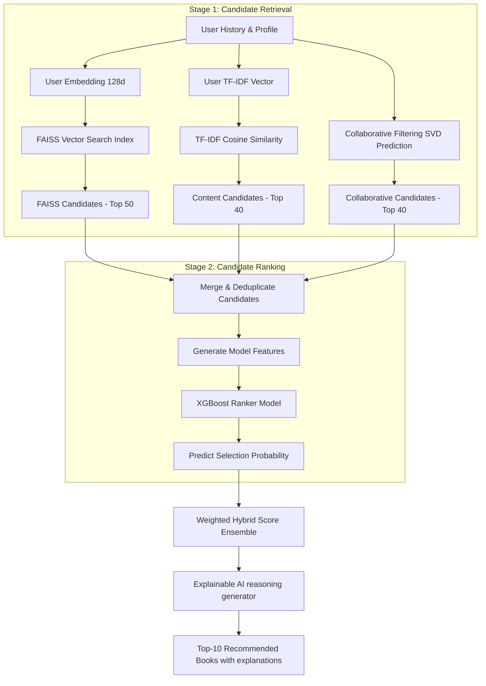

# Novalis: Production-Grade AI Book Recommendation System

Novalis is a state-of-the-art, production-ready Book Recommendation System that mirrors modern recommendation architectures seen at companies like Netflix, Spotify, Amazon, and YouTube.

The system utilizes a **two-stage hybrid recommendation pipeline** combining content-based filtering, collaborative filtering, deep learning embeddings, candidate retrieval with vector search, and candidate ranking with gradient-boosted trees.

---

## 🛠️ Technology Stack
- **Backend API**: Python 3.11+, FastAPI, Uvicorn
- **Data Engineering**: Pandas, NumPy, Scikit-Learn
- **Collaborative Filtering**: Surprise Library (SVD, KNNBasic)
- **Deep Learning**: PyTorch (Two-Tower embedding model)
- **Vector Search**: FAISS (Facebook AI Similarity Search)
- **Ranking Model**: XGBoost (Extreme Gradient Boosting Classifier)
- **Database**: PostgreSQL (with SQLite dynamic fallback)
- **Experiment Tracking**: MLflow
- **Frontend Dashboard**: Streamlit (Premium UI layout)
- **Deployment**: Docker & Docker Compose

---

## 📐 System Architecture

Novalis uses a **Two-Stage Recommendation Pipeline** to deliver sub-millisecond, highly precise recommendations over large-scale catalogs:



1. **Stage 1: Candidate Retrieval (Retrieval Layer)**: Reduces search space from thousands/millions of books to the **Top 100 candidates** using high-recall, low-latency models:
   - **Content-Based Filtering**: cosine similarity of metadata TF-IDF.
   - **Collaborative Filtering**: SVD ratings predictions.
   - **Two-Tower Neural Network**: PyTorch trained, querying a **FAISS** vector index.
2. **Stage 2: Candidate Ranking (Ranking Layer)**: Scores and ranks candidates using an **XGBoost Classifier** trained on historical interaction logs. Features include model similarities, SVD scores, genre Jaccard overlap, author matches, and global book statistics.
3. **Hybrid Ensemble & XAI**: Normalizes individual component outputs and applies a customizable weighted average to generate recommendations with natural language explanations.

---

## 🚀 Quick Start (One-Command Docker Deployment)

You can launch the entire ecosystem (FastAPI, Streamlit, PostgreSQL, and MLflow) using Docker:

```bash
docker-compose up --build
```

Access the services at:
- **Streamlit Frontend Dashboard**: `http://localhost:8501`
- **FastAPI Documentation (Swagger UI)**: `http://localhost:8000/docs`
- **MLflow Server Dashboard**: `http://localhost:5000`

---

## 💻 Local Development Setup (Outside Docker)

If you prefer to run the codebase natively on your host machine:

### 1. Install Dependencies
Ensure you have Python 3.11+ installed. Run:
```bash
pip install -r requirements.txt
```

### 2. Run Data Preprocessing & Model Training
Execute the master pipeline script to generate the synthetic Goodreads-style dataset, preprocess interaction logs, train all recommendation models (SVD, PyTorch, FAISS, and XGBoost), generate the reports, and seed the local SQLite database:
```bash
python train_pipeline.py
```

### 3. Launch the Backend API
Start the FastAPI service:
```bash
uvicorn api.main:app --host 127.0.0.1 --port 8000 --reload
```

### 4. Launch the Streamlit Frontend
Start the interactive dashboard:
```bash
streamlit run frontend/app.py
```

---

## 📡 API Endpoints Reference

### Recommendations
- `GET /recommend/{user_id}`: Retrieves the top-N personalized hybrid recommendations for a registered user, containing book metadata, match score, and natural language explanations.

### Catalog
- `GET /book/{book_id}`: Fetches complete book details.
- `GET /similar-books/{book_id}`: Retrieves content-based similar books using TF-IDF cosine similarity.

### User & Interaction Inputs
- `POST /rate-book`: Logs a user interaction (explicit rating, view, like, or shelve) to the database.
- `POST /new-user`: Registers a new user profile, capturing favorite genres and authors (handles Cold Start questionnaire).

### Diagnostics
- `GET /health`: Checks database health and model loading status.
